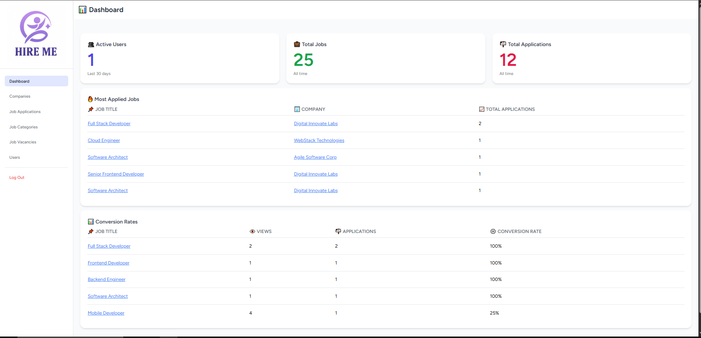
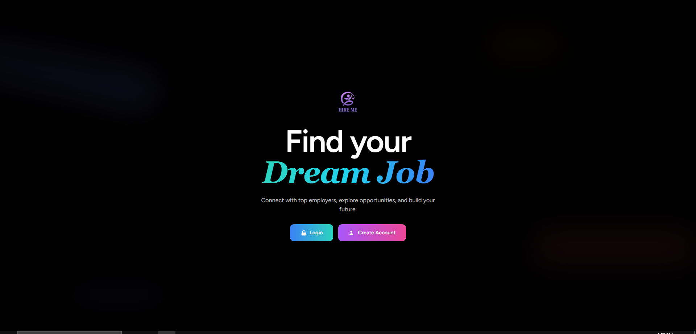

#

# Hire Me — AI-Powered Laravel Job Board Platform

A complete, modern job board platform built with **Laravel** and **Docker**, featuring a clean Tailwind CSS UI, AI-powered application feedback, and full admin/company control over listings and analytics.

---

## 📁 Project Structure

```
job-board/               # Monorepo Root
├── job-app/             # Application for Job Seekers
├── job-backoffice/      # Application for Admins & Company Owners
├── assets/              # Screenshots
|   |
│   |
│   ├── job-welcome.png
│   └── admin-dashboard.png
├── docker-compose.yml
├── README.md (this file)
```

---

## 👥 User Roles

* **Job Seeker**: Browse jobs, apply, receive feedback
* **Company Owner**: Post jobs, manage applicants (for owned companies)
* **Admin**: Full access to manage everything (users, jobs, companies, analytics)

> RBAC (Role-Based Access Control) + OBAC (Ownership-Based Access Control) implemented securely

---

## 🧠 Key Features

### `job-app` — For Job Seekers

* Register/Login with email
* Browse jobs with pagination
* Search and filter by title, company, type
* View full job details
* Upload or reuse resumes
* **AI-Powered Resume Feedback**:

  * Score out of 100%
  * Suggestions to improve
* Track application statuses (Pending, Approved, Rejected)

### `job-backoffice` — For Admins & Company Owners

* Company management (CRUD + assign owners)
* Category management (CRUD)
* Job posting (CRUD)
* Manage applications (view, approve, reject, archive)
* User management (archive users)
* Soft delete (archiving) across all entities
* **Analytics Dashboard**:

  * Active users (last 30 days)
  * Most applied jobs
  * Conversion rate (views vs applications)

---

## 🖼️ Screenshots

### ERD

### Admin Dashboard


### Job Seeker Welcome Page

---

## 🚀 Getting Started with Docker

### 1. Clone the Repository

```bash
git clone https://github.com/MohamedSayedAbdelrazek/job-board.git
cd job-board
```

### 2. Copy Environment Files

```bash
cp job-app/.env.example job-app/.env
cp job-backoffice/.env.example job-backoffice/.env
```

### 3. Start Docker

```bash
docker-compose up -d --build
```

### 4. Run Migrations & Seeders

```bash
docker exec -it job-app php artisan migrate --seed
docker exec -it job-backoffice php artisan migrate --seed
```

### 5. Access Applications

* Job App → [http://localhost:8000](http://localhost:8000)
* Backoffice → [http://localhost:8011](http://localhost:8011)
* PhpMyAdmin → [http://localhost:8081](http://localhost:8081)

---

## 🛠 Tech Stack

* Laravel 12
* PHP 8.3
* Tailwind CSS
* MySQL
* Docker / Docker Compose
* Free AI API for Resume Feedback

---

## 📚 Documentation

- [Requirements Document (PDF)](./docs/Job-Board-Requirements.pdf)
- [ERD Diagram (PDF)](./docs/ERD-Diagram.pdf)
- [Project Structure (PDF)](./docs/ERD-Diagram.pdf)

---

## 🛒 Use Cases

* Ready-to-sell Laravel SaaS product
* Job Board template for clients
* University Final Year Project (FYP)

---

## 📩 Contact

For demo access, source purchase, or customization:
**Email**: [m.s.abdulrazek@gmail.com](m.s.abdulrazek@gmail.com)
